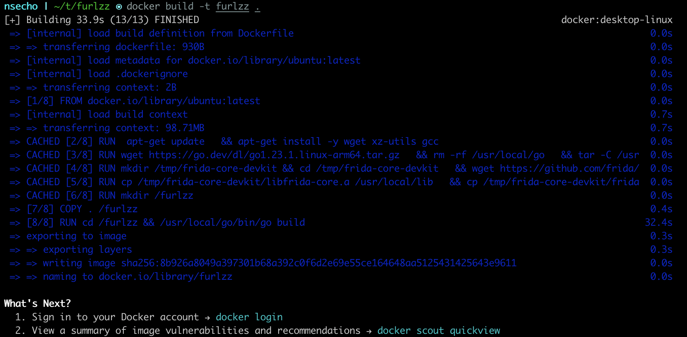
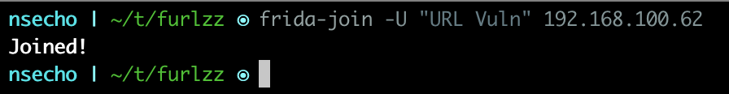
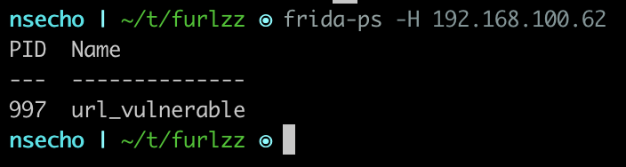
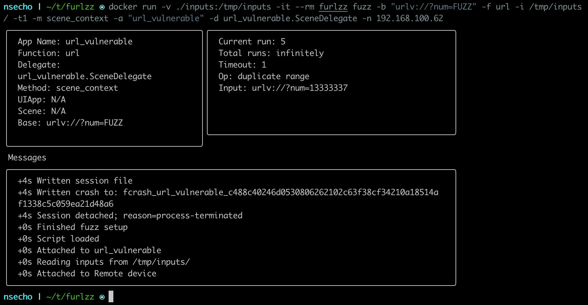

# Introduction
furlzz in a Docker container works using `frida-portal` where the application is run and joined to the frida-portal.
Once we did that we can use furlzz to connect to that portal and fuzz the application.

## Building

```bash
$ git clone https://github.com/NSEcho/furlzz.git && cd furlzz/
$ docker build -t furlzz .
```



## Usage

Download `frida-portal` for your OS and architecture from [here](https://github.com/frida/frida/releases/latest) and run it as
`sudo ./frida-portal-16.5.1-macos-arm64 --cluster-endpoint=0.0.0.0 --control-endpoint=0.0.0.0`.

Make sure to note the IP address of the network which the device can reach (private IPv4 address assuming that both devices are on the same network).

Then run the application and join the portal using `frida-join`.



Once all these steps are finished, run `frida-ps` on the portal to get the correct name of the application (`frida-ps -H portalIPv4Address`).



Now create your inputs directory and run the container.

```bash
$ mkdir inputs 
$ echo -n '13333337' > ./inputs/1
$ mkdir session
$ docker run -v /local/path/to/session/directory:/tmp/session \
-v /local/path/to/inputs/directory:/tmp/inputs -it --rm furlzz fuzz -b BASE_URL \
-f FUNCTION_TO_APPLY_TO_INPUTS -i /tmp/inputs/ -t TIMEOUT \
-m METHOD -a NAME_RETURNED_BY_FRIDA-PS -d OPTIONAL_DELEGATE \
-n IPv4 address of the portal
$ cat session/crashFile
```


